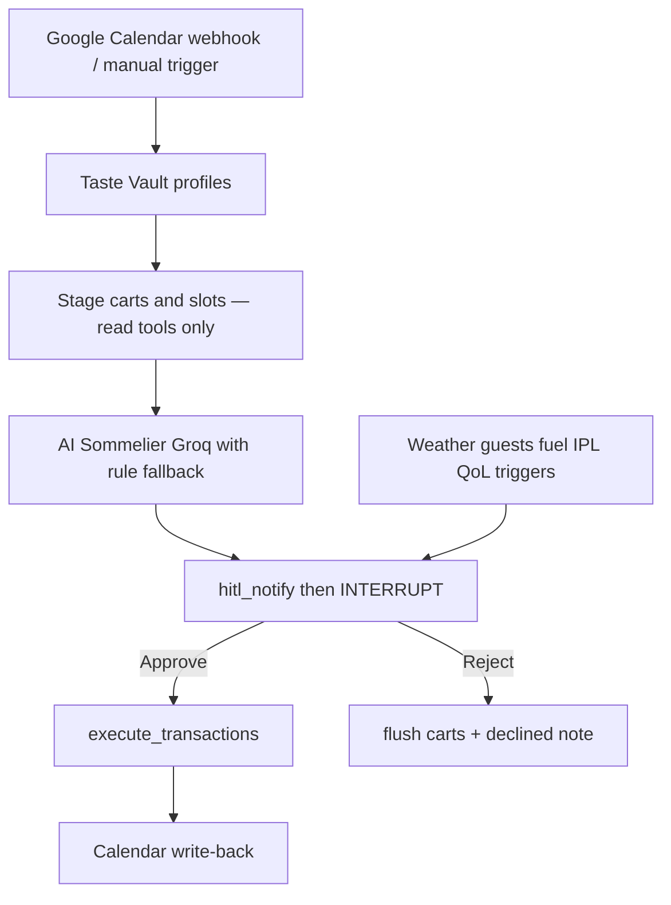

# Autonomous Social Concierge & Swiggy MCP Orchestrator

An automated backend multi-agent system that bridges real-time **Google Calendar** events with real-world logistics using the **Swiggy Model Context Protocol (MCP)** platform.

---

## 🌟 Overview & Workflow

When a user creates or modifies a Google Calendar event containing trigger keywords (`#swiggy` or `#host`), the system runs a **stage → approve → write** lifecycle. Write tools (`book_table`, `place_food_order`, `checkout`) never run before HITL consent.



Ops UI: Next.js **Concierge** tab (`/api/concierge/*` + HITL approve/reject). Setup: [`docs/concierge-setup.md`](docs/concierge-setup.md). Spoken demo script: [`docs/demo-script.md`](docs/demo-script.md).

---

## 🏗️ Technical Stack

* **Language:** Python 3.11+
* **API Framework:** FastAPI (async/await, Pydantic v2 Settings)
* **Orchestration Engine:** LangGraph (StateGraph with conditional edge routing & human-in-the-loop checkpoints)
* **Database & Memory:** SQLite / PostgreSQL with SQLAlchemy 2.0 & stdlib fallback
* **Google Integration:** Google Calendar API v3 & Cloud Pub/Sub push receiver
* **Swiggy MCP Layer:** Streamable HTTP Async Client + OAuth 2.1 PKCE wrapper + local offline mock MCP support

---

## 🚀 Quick Start (Local Setup)

### 1. Prerequisites

* Python 3.11 or newer
* Node.js 20+ (for Next.js frontend if testing UI)
* `ngrok` (for tunneling Google Cloud Pub/Sub webhooks locally)

### 2. Environment Configuration

Copy `.env.example` to `.env` or `backend/.env`:

```bash
cp backend/.env.example backend/.env
```

Configure your environment settings in `.env`:

```env
USE_MOCK_MCP=true
NOTIFICATION_PLATFORM=console  # Options: console, discord, telegram, slack
BASE_URL=http://localhost:8000
GROQ_API_KEY=gsk_your_groq_api_key_here
```

### 3. Install Dependencies & Start Server

Run from the **repo root** (not `backend/`):

```bash
# Install dependencies (prefer the project venv)
pip install -r requirements.txt

# Full API + Concierge (recommended)
uvicorn backend.main:app --reload --host 127.0.0.1 --port 8000
```

If your shell is already in `backend/`, use:

```bash
uvicorn main:app --reload --host 127.0.0.1 --port 8000
```

Verify backend health at: `http://localhost:8000/health/concierge`

---

## 🛰️ Google Webhook & ngrok Setup

To receive real-time push notifications when Google Calendar events are created or updated:

### Step 1: Tunnel your local port with ngrok

```bash
ngrok http 8000
```

Copy the HTTPS forwarding address, e.g., `https://abc1234.ngrok-free.app`.

### Step 2: Configure Google Cloud Pub/Sub Subscription

1. Go to your [Google Cloud Console Pub/Sub Subscriptions](https://console.cloud.google.com/cloudpubsub/subscription).
2. Set the **Push Endpoint URL** to:
   `https://abc1234.ngrok-free.app/webhooks/calendar`
3. Set the authentication token header to match `GOOGLE_PUBSUB_VERIFICATION_TOKEN` in your `.env`.

---

## 🧪 End-to-End Testing Guide

### Option A: Manual Endpoint Trigger (No Google Setup Required)

You can trigger the full autonomous workflow directly via HTTP:

```bash
curl -X POST "http://localhost:8000/api/concierge/trigger" \
  -H "Content-Type: application/json" \
  -d '{
    "event_title": "Friday Team Social",
    "event_time": "2026-07-26T19:00:00+05:30",
    "event_location": "Home",
    "attendee_emails": ["dani@nexus.ai", "priya@nexus.ai"],
    "description": "Hosting team catchup #swiggy"
  }'
```

**Response Output:**

```json
{
  "status": "paused_at_hitl_checkpoint",
  "event_id": "manual_...",
  "approval_request_id": "REQ-7B9F1A2D",
  "mode": "ZERO_TOUCH_HOST",
  "total_cost": 999.0,
  "approve_endpoint": "http://localhost:8000/api/concierge/approve/REQ-7B9F1A2D"
}
```

### Option B: Approving the HITL Checkpoint

Once the pipeline pauses at the HITL guardrail checkpoint, approve financial execution via:

```bash
curl -X POST "http://localhost:8000/api/concierge/approve/REQ-7B9F1A2D" \
  -H "Content-Type: application/json" \
  -d '{"approved": true}'
```

**Result:** The pipeline resumes, calls the `calendar_mutate` node, updates the calendar description with AI Sommelier pairing recommendations, and returns status `COMPLETED`.

---

## 📦 Project Structure

```
.
├── app/
│   ├── api/
│   │   └── webhooks.py          # Google Pub/Sub receiver & HITL approval API
│   ├── config.py                # Pydantic Settings v2 configuration
│   ├── db/
│   │   ├── models.py            # Taste Vault database schemas & SQLite fallback
│   │   └── profiler.py          # Group preference constraint merging logic
│   ├── graph/
│   │   ├── nodes.py             # 7 LangGraph workflow nodes
│   │   ├── state.py             # ConciergeState TypedDict definition
│   │   └── workflow.py          # Compiled StateGraph & edge routers
│   ├── mcp/
│   │   ├── client.py            # Async Swiggy MCP Streamable HTTP client
│   │   └── oauth.py             # OAuth 2.1 PKCE manager
│   ├── services/
│   │   ├── google_calendar.py   # Google Calendar API integration & watch setup
│   │   ├── notifications.py     # Discord / Telegram / Slack webhook notifier
│   │   └── profiler.py          # Taste Memory Vault profiler service
│   └── main.py                  # Standalone FastAPI app
├── backend/
│   ├── main.py                  # Full stack FastAPI backend (includes Concierge)
│   ├── mcp_client.py            # Mock MCP dispatcher client
│   └── memory.py                # Core Nexus database memory
├── mcp_server/                  # Local Mock MCP Servers (Food, Instamart, Dineout)
├── tests/                       # Pytest suite
├── requirements.txt             # Pinned project dependencies
└── README.md                    # Project documentation
```

---

## 🛡️ Security & Operational Guardrails

1. **Idempotency:** Webhook ingestion uses `(event_id, updated_timestamp)` caching to prevent duplicate executions from minor RSVP toggles.
2. **Graceful Degradation:** If Dineout `book_table` fails due to restaurant capacity, conditional routing automatically switches to Zero-Touch Host mode.
3. **HITL Protection:** Financial order placements require explicit human approval via notification webhooks before dispatching transactional MCP tools.
