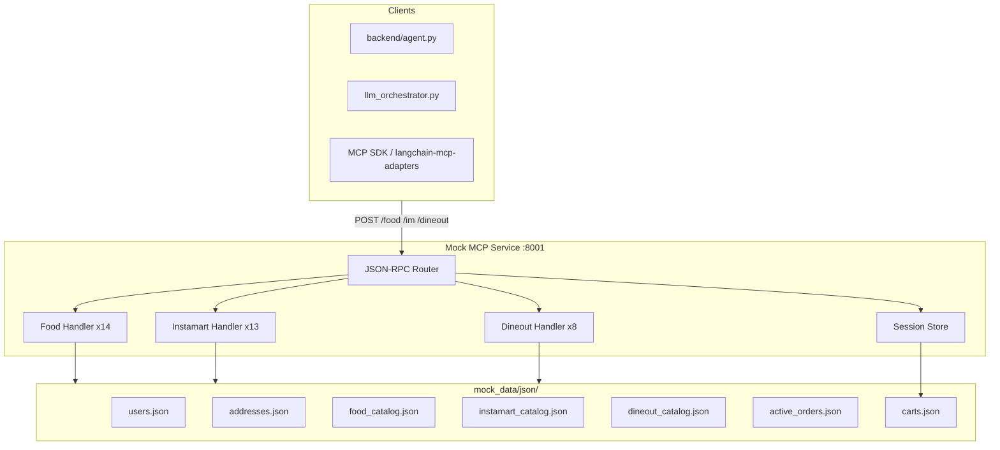

# Phase 3: Production-Schema Mock MCP — Implementation Plan

> **Goal:** Build a bulletproof localhost mock that mirrors Swiggy's **35 tools**, **JSON-RPC 2.0** transport, and **server-side session carts** so swapping `LOCAL_MCP_BASE` → `mcp.swiggy.com` requires **zero agent logic changes**.  
> **Authority:** [`swiggy_mcp_docs.md`](../swiggy_mcp_docs.md) (Phase 1 knowledge base).

---

## 1. Current state vs target

| Dimension | Today ([`mcp_server/`](../mcp_server/)) | Target (mock v2) |
|-----------|----------------------------------------|------------------|
| Protocol | `{ method, params }` | JSON-RPC `tools/call` + `tools/list` |
| Tools | 11 partial | 35 production-named |
| Auth | None | Optional `Authorization: Bearer mock_*` (no-op validator) |
| Cart | Client `requestId` / `cartId` | Session-scoped in-memory + JSON persistence |
| Data | Python modules ([`mock_data/`](../mock_data/)) | Versioned JSON seed files + runtime mutation |
| Stack | FastAPI routes on same app as chat | Dedicated mock service (FastAPI recommended) |

**Recommendation:** **FastAPI** — repo already uses Python for agents, [`backend/mcp_client.py`](../backend/mcp_client.py), and Uvicorn. Avoid introducing Express unless the frontend team owns the mock.

---

## 2. Target architecture



### Service boundaries

| Port | Service | Responsibility |
|------|---------|----------------|
| `8000` | [`backend/main.py`](../backend/main.py) | SSE chat, sidebar, proxies to mock |
| `8001` | `mock_mcp/main.py` (new) | Pure MCP mock — no chat logic |

`LOCAL_MCP_BASE=http://127.0.0.1:8001` when `LOCAL_MCP_HTTP=1`.

---

## 3. JSON-RPC transport layer

### Request (production-identical)

```http
POST /food HTTP/1.1
Host: 127.0.0.1:8001
Content-Type: application/json
Authorization: Bearer mock_dev_token
Mcp-Session-Id: sess_abc123

{
  "jsonrpc": "2.0",
  "method": "tools/call",
  "params": {
    "name": "search_restaurants",
    "arguments": { "addressId": "addr_kp_001", "query": "biryani" }
  },
  "id": 1
}
```

### Response

```json
{
  "jsonrpc": "2.0",
  "id": 1,
  "result": {
    "success": true,
    "data": { "restaurants": [] },
    "message": "optional"
  }
}
```

### `tools/list` support

Return OpenAI/MCP-compatible tool definitions generated from [`swiggy_mcp_docs.md`](../swiggy_mcp_docs.md) §7 TypeScript appendix (convert to JSON Schema).

### Backward compatibility shim (optional, 1 sprint)

Accept legacy `{ method, params }` on same routes; log deprecation warning. Remove after [`backend/mcp_client.py`](../backend/mcp_client.py) migrates.

---

## 4. Dummy JSON databases

Create [`mock_data/json/`](../mock_data/json/) (committed seed data; runtime writes go to `mock_data/json/.runtime/` gitignored).

### 4.1 `users.json`

```json
{
  "users": [
    {
      "userId": "user_demo_001",
      "userName": "Aanya Sharma",
      "userPhone": "+919876543210",
      "defaultAddressId": "addr_kp_001"
    }
  ]
}
```

### 4.2 `addresses.json`

Production-shaped (no lat/lng in `get_addresses` responses):

```json
{
  "addresses": [
    {
      "addressId": "addr_kp_001",
      "label": "Home",
      "fullAddress": "Rosary School Road, Near German Bakery, Koregaon Park, Pune 411001",
      "addressLine": "Rosary School Road",
      "addressLine2": "Near German Bakery",
      "locality": "Koregaon Park",
      "city": "Pune",
      "postalCode": "411001",
      "addressCategory": "HOME",
      "_latitude": 18.5362,
      "_longitude": 73.8958
    }
  ]
}
```

`_latitude` / `_longitude` are **internal only** — stripped from `get_addresses` output per privacy rule.

### 4.3 `food_catalog.json`

Migrate from [`mock_data/food_catalog.py`](../mock_data/food_catalog.py):

- Restaurants with `id`, `name`, `rating`, `distanceKm`, `availabilityStatus`, `deliveryTimeRange`, `deliveryTimeSpoken`, `cuisines`
- Menus: categories, items with `hasVariants`, `hasAddons`, `variants` / `variantsV2`, `addons`
- Coupons: `code`, `requiresOnlinePayment`, `discountAmount`

### 4.4 `instamart_catalog.json`

Products with `variants[].spinId`, `price`, `inStock` per `addressId`.

### 4.5 `dineout_catalog.json`

Restaurants with `availability`, `costForTwo`, slots by `restaurantId` + `date` + `guestCount`.

### 4.6 `active_orders.json` + `bookings.json`

Append-only style lists mutated by `place_food_order`, `checkout`, `book_table`.

### 4.7 `carts.json` (runtime)

Keyed by `Mcp-Session-Id` or derived session from Bearer token:

```json
{
  "sess_abc": {
    "food": { "restaurantId": "rest_001", "items": [], "coupon": null, "addressId": "addr_kp_001" },
    "im": { "selectedAddressId": "addr_kp_001", "items": [] },
    "dineout": {}
  }
}
```

---

## 5. Session & cart semantics

Implement exactly as [`swiggy_mcp_docs.md`](../swiggy_mcp_docs.md) §4:

| Rule | Implementation |
|------|----------------|
| Server-side cart | All cart tools read/write `carts.json` by session ID |
| Food single-restaurant | Changing `restaurantId` in `update_food_cart` flushes previous items; return warning in `message` |
| Instamart address bind | `clear_cart` required before `selectedAddressId` change; else return `ADDRESS_NOT_SERVICEABLE` class error |
| Cart TTL | Optional: expire carts after 30 min idle; return `CART_EXPIRED` |
| No client cart ID | Remove `requestId` / `cartId` from agent contracts |

**Session ID source:** `Mcp-Session-Id` header (MCP streamable HTTP convention) or hash of `Authorization` bearer.

---

## 6. Tool implementation roadmap (35 tools)

### Sprint 1 — Foundation (week 1)

| # | Task | Files |
|---|------|-------|
| 1 | Scaffold `mock_mcp/` package | `main.py`, `rpc.py`, `session.py` |
| 2 | JSON loaders + seed migration script | `mock_data/json/*`, `scripts/migrate_mock_to_json.py` |
| 3 | `tools/list` for Food | `mock_mcp/schemas/food.json` |
| 4 | Food discover tools | `get_addresses`, `search_restaurants`, `get_restaurant_menu`, `search_menu` |
| 5 | Unit tests per tool | `tests/mock_mcp/test_food_discover.py` |

### Sprint 2 — Food cart & order (week 2)

| Tools | Notes |
|-------|-------|
| `update_food_cart`, `get_food_cart`, `flush_food_cart` | `valid_addons` in cart response |
| `fetch_food_coupons`, `apply_food_coupon` | Filter COD-compatible coupons |
| `place_food_order` | Enforce ₹1000 cap; `paymentMethod: COD` |
| `get_food_orders`, `get_food_order_details`, `track_food_order` | Append to `active_orders.json`; track states advance on timer |
| `report_error` | Return mailto link stub |

### Sprint 3 — Instamart (week 3)

All 13 tools including `create_address`, `delete_address` (mutate `addresses.json`), `your_go_to_items`, `checkout` with ₹99 minimum.

### Sprint 4 — Dineout (week 4)

All 8 tools; `book_table` requires prior `get_available_slots` data; `create_cart` for deal flow; free reservations only (`isFree=true`).

### Sprint 5 — Integration (week 5)

| # | Task |
|---|------|
| 1 | Update [`backend/mcp_client.py`](../backend/mcp_client.py) to JSON-RPC + canonical tool names |
| 2 | Update [`backend/llm_orchestrator.py`](../backend/llm_orchestrator.py) tools from `tools/list` or shared schema |
| 3 | Refactor [`backend/agent.py`](../backend/agent.py) flows to production tool chain (7-tool food journey) |
| 4 | Compatibility tests: same agent code against mock vs recorded production fixtures |
| 5 | Update [`docs/local-mock-mcp.md`](local-mock-mcp.md) |

---

## 7. Per-vertical handler layout

```
mock_mcp/
├── main.py                 # FastAPI app, mounts /food /im /dineout
├── rpc.py                  # JSON-RPC parse/dispatch
├── session.py              # Session + cart store
├── errors.py               # Swiggy error envelope helpers
├── latency.py              # 300–800ms jitter (from mcp_server/common.py)
├── food/
│   ├── __init__.py
│   ├── handlers.py         # 14 dispatch functions
│   └── responses.py        # Response builders
├── instamart/
│   ├── handlers.py
│   └── responses.py
├── dineout/
│   ├── handlers.py
│   └── responses.py
└── schemas/
    ├── food_tools.json     # tools/list output
    ├── instamart_tools.json
    └── dineout_tools.json
```

Keep [`mcp_server/`](../mcp_server/) until mock v2 passes parity tests; then deprecate.

---

## 8. Response fidelity rules

1. **Inputs:** Validate against TypeScript interfaces in [`swiggy_mcp_docs.md`](../swiggy_mcp_docs.md) §7; return HTTP 200 + `success: false` for domain errors (match production).
2. **Outputs:** Include all fields referenced in agent guidance (e.g. `availabilityStatus`, `distanceKm`, `spinId`, `valid_addons`, `availablePaymentMethods`).
3. **Do not invent** fields not in docs; mark gaps in `mock_mcp/SCHEMA_GAPS.md`.
4. **Latency:** Reuse `simulated_latency_jitter_ms()` from [`mcp_server/common.py`](../mcp_server/common.py).
5. **Widgets:** Omit iframe widgets in v2.0; return `data` only.

### Example: `search_restaurants` response shape

```json
{
  "success": true,
  "data": {
    "restaurants": [
      {
        "id": "rest_001",
        "name": "Biryani House",
        "rating": 4.5,
        "distanceKm": 2.1,
        "availabilityStatus": "OPEN",
        "deliveryTimeRange": "25-35 MIN",
        "deliveryTimeSpoken": "about 30 minutes",
        "cuisines": ["Biryani", "North Indian"]
      }
    ],
    "nextOffset": 5
  }
}
```

---

## 9. Error simulation

Support test toggles via header `X-Mock-Scenario`:

| Value | Behavior |
|-------|----------|
| `restaurant_closed` | `search_restaurants` returns CLOSED entries |
| `cart_expired` | `get_food_cart` returns `CART_EXPIRED` message |
| `slot_gone` | `book_table` fails; agent should call `get_available_slots` |
| `upstream_502` | 502 with retry guidance |
| `cap_exceeded` | `place_food_order` rejects cart > ₹1000 |

---

## 10. Testing strategy

| Layer | What |
|-------|------|
| **Unit** | Each handler: valid input → expected `data` shape |
| **Recipe** | Scripted 7-tool Food journey, 6-tool Instamart, 6-tool Dineout |
| **Contract** | JSON Schema validation of responses against `swiggy_mcp_docs.md` |
| **Agent E2E** | `backend/test_chat.py` prompts: pizza, groceries, book table, combined evening |
| **Idempotency** | Double `place_food_order` does not duplicate orders |

```bash
# Run mock standalone
uvicorn mock_mcp.main:app --port 8001

# Smoke: tools/list
curl -s -X POST http://127.0.0.1:8001/food \
  -H "Content-Type: application/json" \
  -d '{"jsonrpc":"2.0","method":"tools/list","id":1}'

# Smoke: get_addresses
curl -s -X POST http://127.0.0.1:8001/food \
  -H "Content-Type: application/json" \
  -H "Mcp-Session-Id: test_sess" \
  -d '{"jsonrpc":"2.0","method":"tools/call","params":{"name":"get_addresses","arguments":{}},"id":2}'
```

---

## 11. Agent migration checklist (zero logic change at swap)

- [ ] Tool names: `get_menu` → `get_restaurant_menu`, `add_to_cart` → `update_food_cart`, `place_order` → `place_food_order`
- [ ] Remove `requestId` / `cartId` from agent prompts and tool args
- [ ] Add `get_food_cart` / `get_cart` at every turn boundary before cart mutations
- [ ] Instamart: `add_to_cart` → `update_cart` with `selectedAddressId` + `spinId`
- [ ] Dineout: `check_availability` → `get_available_slots`; add `get_saved_locations` first
- [ ] MCP client: JSON-RPC wrapper, `Authorization` header injection point for prod
- [ ] LLM orchestrator: load tools from `tools/list` instead of hardcoded 11 tools

---

## 12. Production cutover

When OAuth credentials arrive:

1. Set `SWIGGY_MCP_TOKEN` in `backend/.env` (never `NEXT_PUBLIC_*`).
2. Point `langchain-mcp-adapters` / MCP SDK at `https://mcp.swiggy.com/{food,im,dineout}`.
3. Keep mock on `:8001` for CI and offline dev.
4. Feature flag: `MCP_MODE=mock|production` in [`backend/mcp_client.py`](../backend/mcp_client.py).

---

## 13. Estimated effort

| Sprint | Duration | Outcome |
|--------|----------|---------|
| 1–2 | 2 weeks | Food vertical production-parity |
| 3 | 1 week | Instamart vertical |
| 4 | 1 week | Dineout vertical |
| 5 | 1 week | Agent + UI integration |
| **Total** | **~5 weeks** | Full 35-tool mock + agent swap |

---

## 14. Immediate next actions

1. Create `mock_data/json/` seed files from existing Python catalogs.
2. Scaffold `mock_mcp/main.py` with JSON-RPC router.
3. Implement `get_addresses` + `search_restaurants` as first vertical slice.
4. Add `tests/mock_mcp/test_food_discover.py` with schema assertions.
5. Run Chrono-Host scenario (Use Case 2) as first cross-server integration test once Sprint 4 completes.
