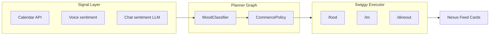
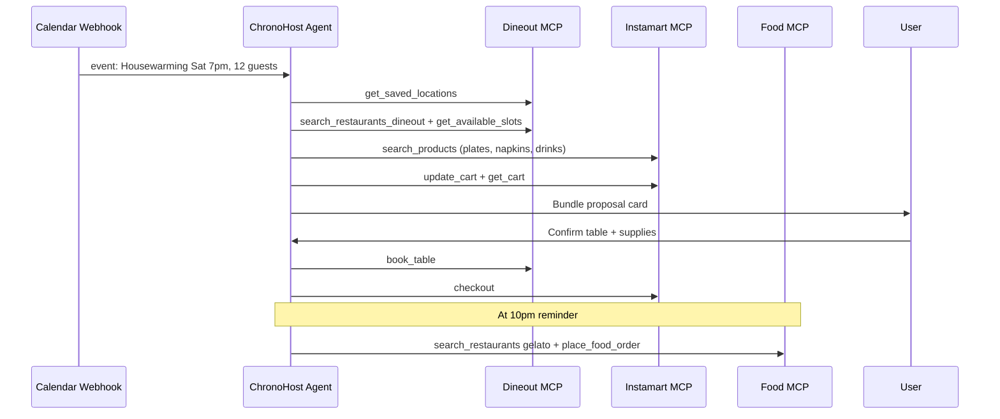
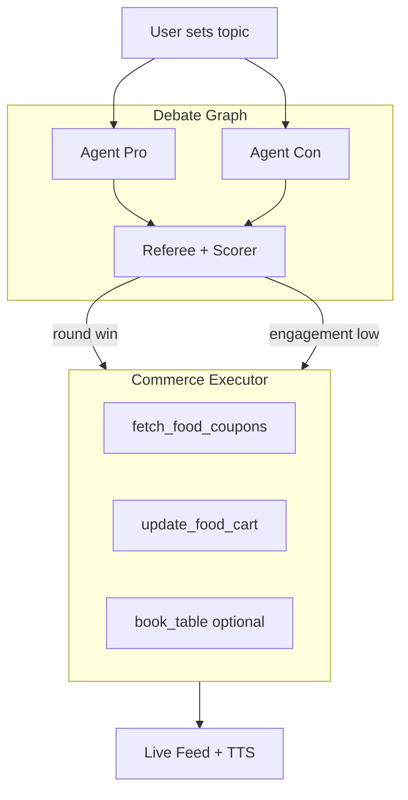

# Phase 2: Ambitious Swiggy × Nexus Agent Use Cases

> **Context:** Swiggy Nexus today runs a Planner → Executor → Synth pipeline ([`backend/agent.py`](../backend/agent.py), [`frontend/lib/demo-chat-mock.ts`](../frontend/lib/demo-chat-mock.ts)) over a partial local mock MCP. Production Swiggy exposes **35 tools** across Food, Instamart, and Dineout ([`swiggy_mcp_docs.md`](../swiggy_mcp_docs.md)). These three concepts assume the Phase 3 production-schema mock (or real OAuth) is wired in, and optionally a LangGraph-style multi-node orchestrator replacing keyword heuristics.

---

## Use Case 1: **Sentiment Thermostat** — Autonomous Comfort Commerce

### The idea

A background **affect monitor** (voice tone, typing cadence, calendar density, or explicit mood check-ins) drives a dedicated *Comfort Agent* that silently prepares—but never auto-places—Swiggy orders when emotional telemetry crosses thresholds.

### Why it's ambitious

- Spans **all three MCP servers** in one session: Dineout for "get me out of the house" depression spikes, Food for classic comfort orders, Instamart for late-night self-care (tea, chocolate, electrolytes).
- Violates the naive "user asks → agent orders" pattern: the agent **proposes** commerce as therapy infrastructure.
- Requires strict guardrails from Swiggy docs: `place_food_order`, `checkout`, and `book_table` are **non-idempotent**; confirmation is mandatory ([`swiggy_mcp_docs.md`](../swiggy_mcp_docs.md) §4, §6).

### Architecture

### Swiggy tool choreography (example: "stress score 0.82, Friday 9pm, alone")

| Step | Tool | Purpose |
|------|------|---------|
| 1 | `get_addresses` | Default to Home without asking (voice contract) |
| 2 | `your_go_to_items` | One-call reorder path for Instamart comfort SKUs |
| 3 | `search_restaurants` (query: "dessert") | Parallel Food option if go-to items empty |
| 4 | `get_food_cart` | Refresh server cart before any mutate |
| 5 | `update_food_cart` | Stage cart; **stop** |
| 6 | UI | "Rough day? I staged your usual chamomile + dark chocolate (₹189). Place or tweak?" |

**Dineout branch** (weekend + social isolation + high stress): `get_saved_locations` → `search_restaurants_dineout` (query: "quiet cafe") → `get_available_slots` → surface slots only; book only after explicit "yes."

### Nexus integration points

- **Signals bar** ([`demo-chat-mock.ts`](../frontend/lib/demo-chat-mock.ts) already has `deepWork`, `rainPune`, `watchParty`): add `moodScore` and `isolationIndex` synthetic signals for demo.
- **Memory** ([`backend/memory.py`](../backend/memory.py)): persist `comfort_food_profile`, `last_comfort_intervention_at` to avoid nagging.
- **SSE contract**: new `thinking` flavour — `Planner · Affect` — without exposing raw scores to end users.

### Success metric

User accepts a staged order within 2 turns **without** feeling surveilled; zero autonomous placements.

---

## Use Case 2: **Chrono-Host** — Calendar-Native Event Orchestrator

### The idea

An **Event Planning Agent** subscribes to Google/Outlook calendar webhooks. For each social event it detects (birthday dinner, housewarming, watch party), it autonomously drafts a **fulfilment bundle**: Dineout table + Instamart party supplies + Food dessert delivery timed to the event end.

### Why it's ambitious

- Implements Swiggy's [**combined recipe**](https://mcp.swiggy.com/builders/docs/build/recipes/combined.md) at production scale—not one-off prompts.
- Handles **cross-server state**: Food `addressId` vs Dineout `lat/lng` ([`swiggy_mcp_docs.md`](../swiggy_mcp_docs.md) §5 combined gotchas).
- Works around v1 limitation: Food has **no scheduled delivery**—agent must set reminders and place dessert order at runtime, not at planning time.

### Architecture

### Tool matrix per event type

| Event signal | Dineout | Instamart | Food |
|--------------|---------|-----------|------|
| `team_dinner` (existing scenario) | `book_table` 8pm, party=6 | — | — |
| `watch_party` | — | snacks, beverages via `search_products` | pizza via `search_menu` |
| `housewarming` | brunch slot | cleaning + decor SKUs | cake delivery post-event |
| `recipe_night` | — | `search_products` for missing pantry diff (Zero-waste scenario) | — |

### Nexus integration points

- Extend **Reviewer scenarios** in [`PITCH.md`](../PITCH.md): `chrono_host` preset injecting a fake calendar ICS payload into chat context.
- **Planner** reads `ctx.event` (title, start, attendees, location) alongside existing `partySize` / `budgetInr`.
- **Feed mapper** ([`frontend/lib/feed-mapper.ts`](../frontend/lib/feed-mapper.ts)): composite card type `EventBundle` showing three vertical sub-cards with independent confirm buttons.

### Success metric

One user confirmation approves table + groceries; dessert fires on schedule with second confirmation; no duplicate bookings on 5xx retry (`get_booking_status` / `get_orders` idempotency checks per docs).

---

## Use Case 3: **Dialectic Dinner** — Multi-Agent Debate with Stakes

### The idea

Two (or more) **persona agents** argue a user-selected topic (AI ethics, best Marvel film, rent vs buy). A **Referee Agent** tracks argument quality via rubric scoring. When a side "wins" a round—or when engagement drops—the system triggers **Swiggy consequences**: winner picks dinner cuisine, loser pays (staged COD cart), or the group orders Instamart "debate snacks" mid-session.

### Why it's ambitious

- Combines **LangGraph-style multi-agent** topology with real commerce side-effects—not RAG, not fake "I'll order that."
- Uses **multi-turn cart state** patterns: every round boundary calls `get_food_cart` / `get_cart` before mutating ([`swiggy_mcp_docs.md`](../swiggy_mcp_docs.md) §4).
- Dineout integration for "let's settle this over dinner" → live table booking as debate forfeit mechanic.

### Architecture

### Round → commerce triggers

| Trigger | Swiggy action | Tools |
|---------|---------------|-------|
| Pro wins round 2 | Loser owes snacks | `search_products` → `update_cart` → confirm → `checkout` |
| Debate stalemate 15 min | Neutral comfort | `your_go_to_items` → `update_cart` |
| User says "order winner's pick" | Food victory lap | `search_restaurants` (cuisine from winner) → `search_menu` → `update_food_cart` → `fetch_food_coupons` → `apply_food_coupon` → `place_food_order` |
| "Take this offline" | Dineout | Full book-a-table chain |

### Guardrails (from official agent guidance)

- Restaurant switch flushes Food cart—Referee must warn if debate pivots cuisine mid-cart.
- ₹1000 Food cap: debate "feast" orders need cart splitting or app handoff.
- Voice mode: max 3 restaurant options read aloud; never speak `addressId` / `spinId`.

### Nexus integration points

- New chat mode: **Arena** layout with side-by-side agent streams + central Referee strip.
- [`llm_orchestrator.py`](../backend/llm_orchestrator.py): replace flat tool list with server-prefixed tools (`food_search_restaurants`, etc.) from `langchain-mcp-adapters` once mock v2 ships.
- **SQLite memory**: store debate history + per-persona food preferences for personalized stakes.

### Success metric

Commerce actions feel narratively tied to debate outcomes; 100% user confirmation before any `place_food_order` / `checkout` / `book_table`; demo completes a full 7-tool Food journey in under 3 minutes.

---

## Recommended build order

| Priority | Use case | Depends on |
|----------|----------|------------|
| 1 | Chrono-Host | Combined recipe + mock v2 (all 35 tools) |
| 2 | Dialectic Dinner | LangGraph multi-agent + Food cart tools |
| 3 | Sentiment Thermostat | External signal APIs + policy layer |

## Next step

Implement the production-schema mock per [`mock-mcp-implementation-plan.md`](mock-mcp-implementation-plan.md), then wire **Chrono-Host** as the first end-to-end vertical integration test across all three MCP servers.
